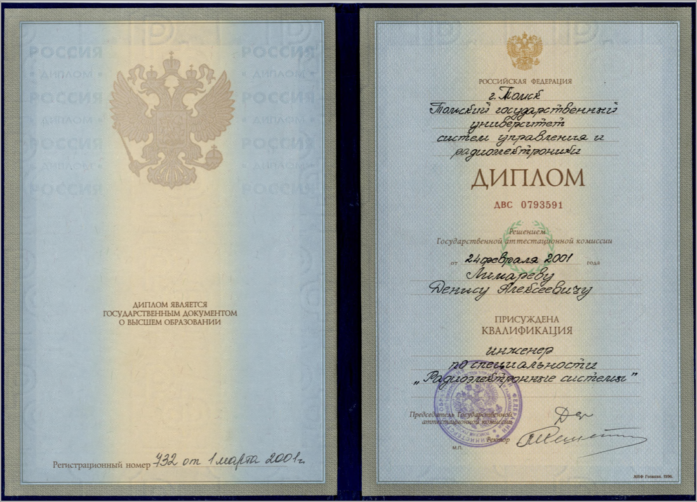
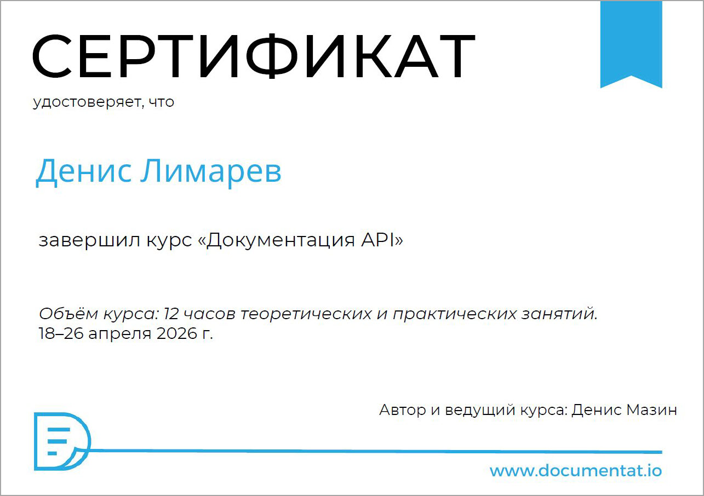
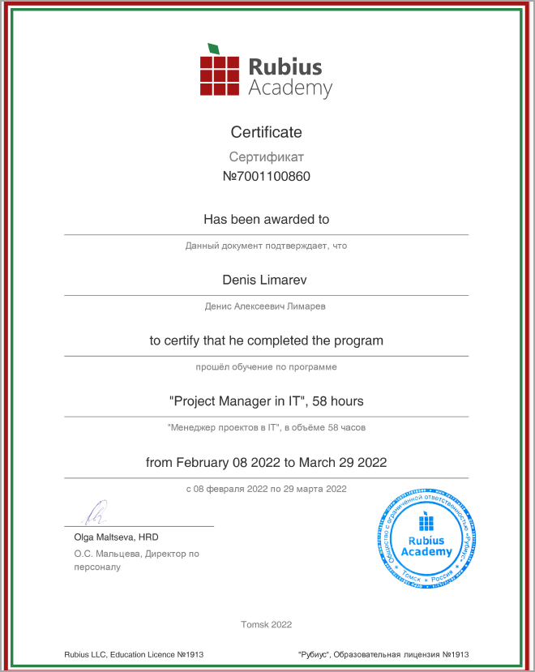
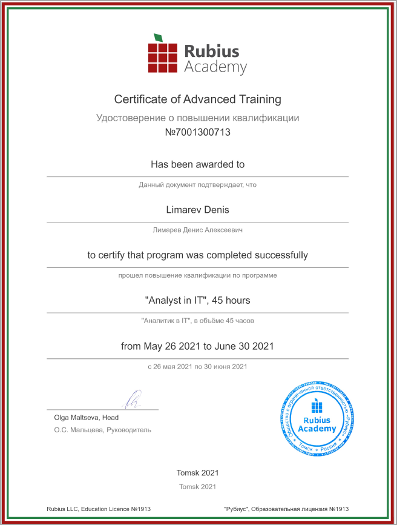
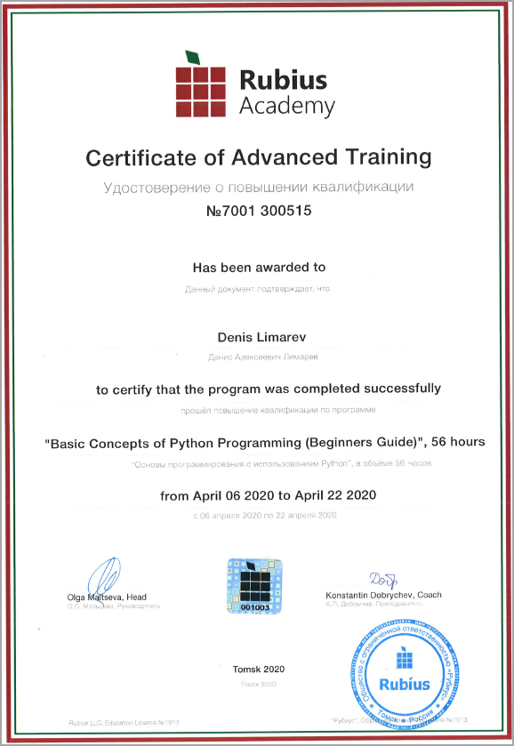
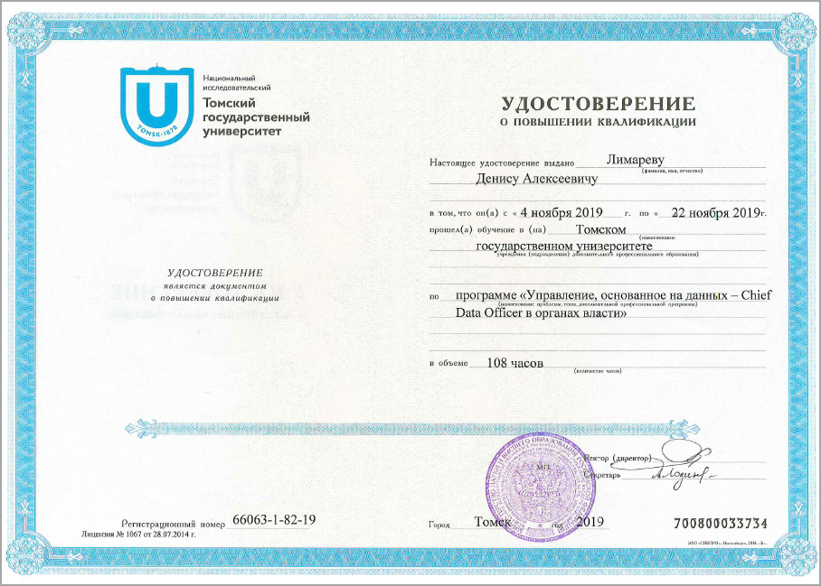

## Общие сведения

!!! warning "Внимание!"

    Все сведения предоставлены только для ознакомления сотрудников HR-служб и коллег. Чтобы использовать любую информацию из этого источника в любых других целей, необходимо получить письменное разрешение от автора, обратившись к нему по электронной почте: <limarev.da@gmail.com>

  
**Денис Лимарев**

Работаю техническим писателем с 2022 года, до этого трудился в IT-сфере на различных должностях с 2009 года.

Закончил в 2001 году ТУСУР, Радиотехнический факультет, инженер-системотехник по специальности «Радиоэлектронные системы и комплексы».

Сертификаты дополнительных курсов представлены в разделе ниже.

Женат, двое детей, люблю горы, интеллектуальные игры и узнавать что-то новое. Проживаю в городе Томске.
Коммуникабелен, легко нахожу общий язык с коллегами.
Благодаря тому, что с 2009 года в IT-сфере и много лет работал системным администратором, быстро вхожу в любой технологический процесс разработки ПО, хорошо ориентируюсь в software и hardware-оборудовании. 
Опыт работы заместителем руководителя и начальником отдела технической документации позволяет мне эффективно работать на любой должности с большой ответственностью.

Был докладчиком на двух конференциях Techwrite Days:

* 2025 год, Санкт-Петербург. [Найти и не терять! Поиск техрайта в команду: квест с открытым финалом](https://techwriterdays.ru/ru/talk/126167). 
* 2026 год, Москва. [Имбовый портал документации на MkDocs: Markdown, Docs as Code и CD. Что сегодня и что завтра](https://techwriterdays.ru/ru/talk/140839).

---
## Резюме

* [Моё резюме на HH.RU](https://tomsk.hh.ru/resume/bbc38791ff09ca9e1a0039ed1f5148654a7830).
* [Моё резюме в формате PDF](limarevda-cv.pdf).

---

## Примеры работ

1. Пример пользовательской документации в парадигме Docs as Code: [Руководство администратора. Веб-интерфейс](https://sharxbase.docs.sharxdc.ru/6.3/admin_guide_web/index.html). Исходные документы в формате Markdown, публикация с помощью MkDocs, используется шаблонизатор Ninja.

1. Пример документации API: [Описание API DOUMENTAT.IO](https://dennnis-2020.github.io/mkdocs/). Спецификация API выполнена в формате YAML по версии OPENAPI 3.0.0. Публикация с помощью MkDocs.

1. Техническое описание (Datasheet) в формате [PDF](ds.pdf).

## Дипломы и сертификаты

  

  

 

 

 

 
